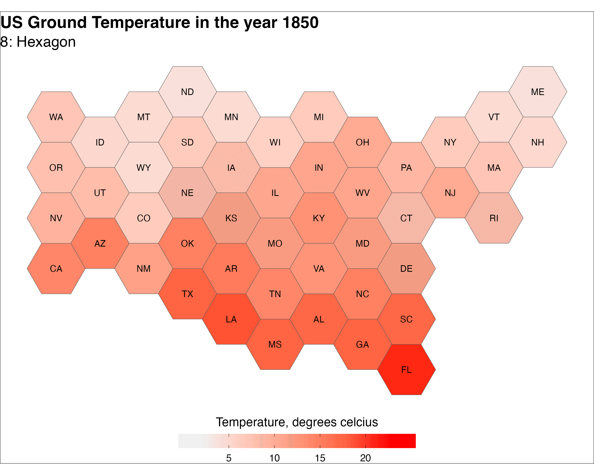

# #mapchallenge
30 daily maps for November 

### Day 1: Points

### Day 2: Lines

### Day 3: Polygons

### Day 4: A bad map

### Day 5: Analog

### Day 6: Asia

### Day 7: Navigation

### Day 8: Africa

### Day 9: Hexagons

### Day 10: North America
The Movement Patterns of Three Snowy Owls, 2015

